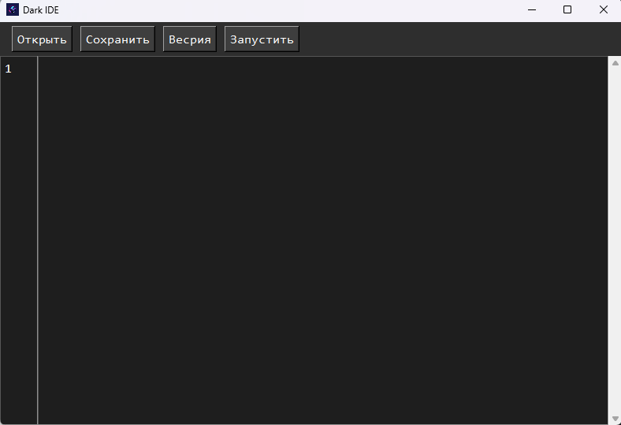
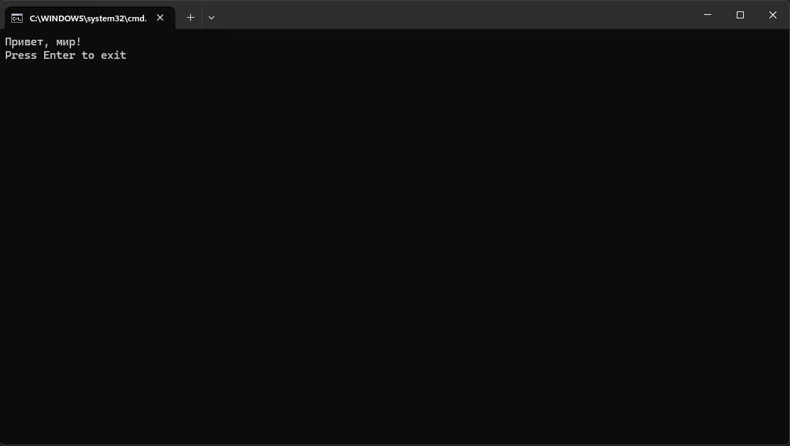

# Python Dark Programming Language

Приветствую вас в **Python Dark Programming Language** — моём собственном языке программирования, созданном на всем известном Python. Этот проект создан в целях исследования новых возможностей и изучения Python.

## Описание

Dark — это язык программирования, созданный мной в 14 лет.

## Особенности

- **Уникальный синтаксис**: Не часто встречается такой же синтаксис.
- **Основа программирования**: Для программирования используются ключевые слова такие как `output`, `set` или `upd`.

## Функционал

- **output**: одно из основных ключевых слов для вывода данных.
- **set**: ключевое слово для присвоения значения переменной или создания поля ввода.
- **upd**: ключевое слово для обновления данных.

## Установка

Чтобы начать использовать Dark, выполните следующие шаги:

1. Убедитесь, что у вас установлен Python (версии 3.10 и выше).
2. Склонируйте репозиторий:

   ```bash
   git clone https://github.com/vsp210/python-dark-programing-lang.git
   ```

3. Перейдите в каталог репозитория:
Вы увидите такую файловую структуру:
```
/python-dark-programing-lang/
   /source-code/
      /dark.py
      /IDE.py
   /dark_lang_code/
      /classes.py
      /dark.py
      /mod.py
   /dark-1.exe
   /dark.exe
   /IDE.exe
   /README.md
```
4. Затем, если вы работаете на Windows, то запустите файл IDE.exe.
5. После запуска файла IDE вы увидите интерфейс.

6. Теперь можно писать код или открыть существующий файл кода. Пример кода:
```dark
output Привет, мир!
```
7. После написания кода нажмите кнопку "Запустить", и у вас откроется cmd терминал, где можно увидеть фразу "Привет, мир!".

(Также можно запустить программы через файл dark.exe)

## Пример использования некоторых функций:
```Dark
output Hello World!

set list myVar 1|2|3
output [{myVar.type}]
output [{myVar}]

set input str myVarInput Введите текст:\n\s
output [{myVarInput}]. Хороший текст!

set output int myVarOutput 123

if myVarOutput == 123 => output hi \|/ set input str myVarInput Привет\n \|/ output myVarInput

delete myVarOutput
delete myVar
delete myVarInput
```

## Контакты
ВКонтакте: https://vk.com/vsp210
Телеграм: https://t.me/vsp210
Моё портфолио: https://vsp210.github.io/portfolio/


# Обновление:
#### В последней версии добавлены следующие функции:
- Модифицирование - это возможность создавать свои модификации на языке программирования Python и подключать к языку программирования Dark: Пример:
```
/python-dark-programing-lang/
   /mods/                 - Создаём папку для модификаций
      /test/              - Создаём папку с именем модификации
         /initialize.py   - Файл для инициализации модификаций
         /main.py         - Файл для основной логики модификации
   /source-code/
      /dark.py
      /IDE.py
   /dark_lang_code/
      /classes.py
      /dark.py
      /mod.py
   /dark-1.exe
   /dark.exe
   /DarkInstaller.exe - используйте для установки модификаций инструкция на сайте https://psv449.pythonanywhere.com/
   /IDE.exe
   /README.md
```
- [**main.py**]():
```python
def hi_function(*args):
    return str(args) + ' - Hi'

def bye_function(*args):
    return str(args) + ' - Bye'
```
- [**initialize.py**]()
```python
from dark_lang_code.classes import add_mod

add_mod('hi', hi_function)
add_mod('bye', bye_function)
```

##### Теперь можно использовать модификацию в Dark
```dark
mods init

import hi
import bye

hi Привет

set str text Пока

bye [{ text }]
```

###### Этот модификатор позволяет выводить любой текст с текстом Hi или Bye

##### Теперь можно совершать импорты к другим фаилам .dark
Пример:

file1.dark:
```dark
<-#-> Импорт переменной:
from путь/до/file2.dark import_var test
<-#-> Иморт блока:
from путь/до/file2.dark import_block test_block

<-#-> Вывод переменной и запуск блока:
output [{test}]
run-block test_block
```

file2.dark:
```dark
<-#-> Переменная:
set str test Hello World
<-#-> Блок:
set block test_block => output Hi, I Dark!
```

##### Вывод:
```bash
Hello World
Hi, I Dark!
```
